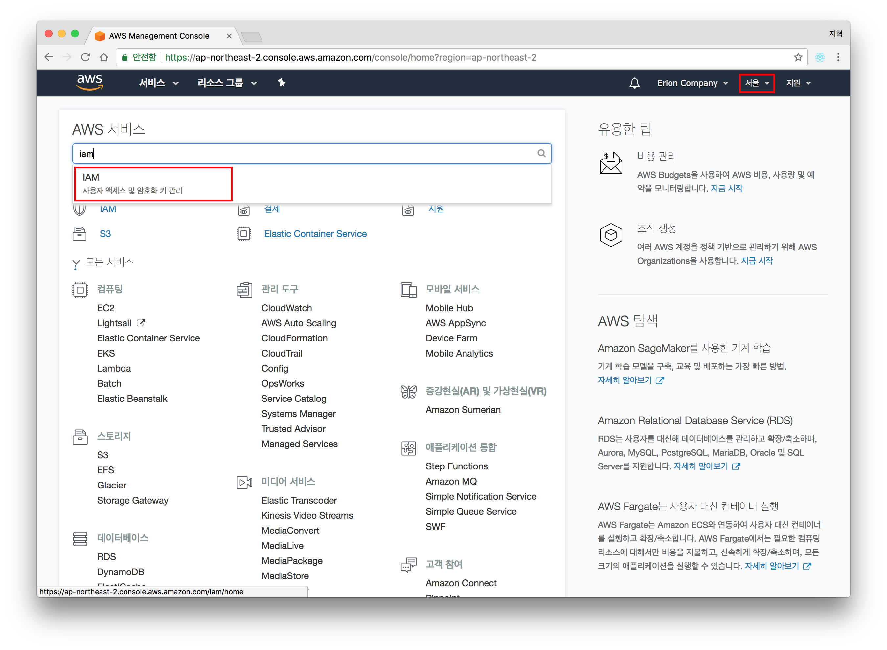
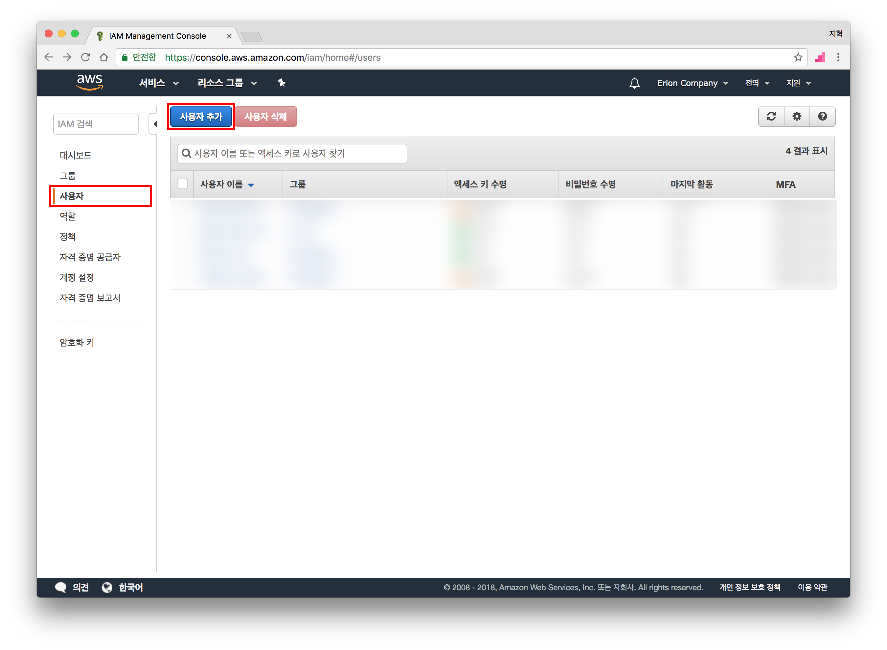
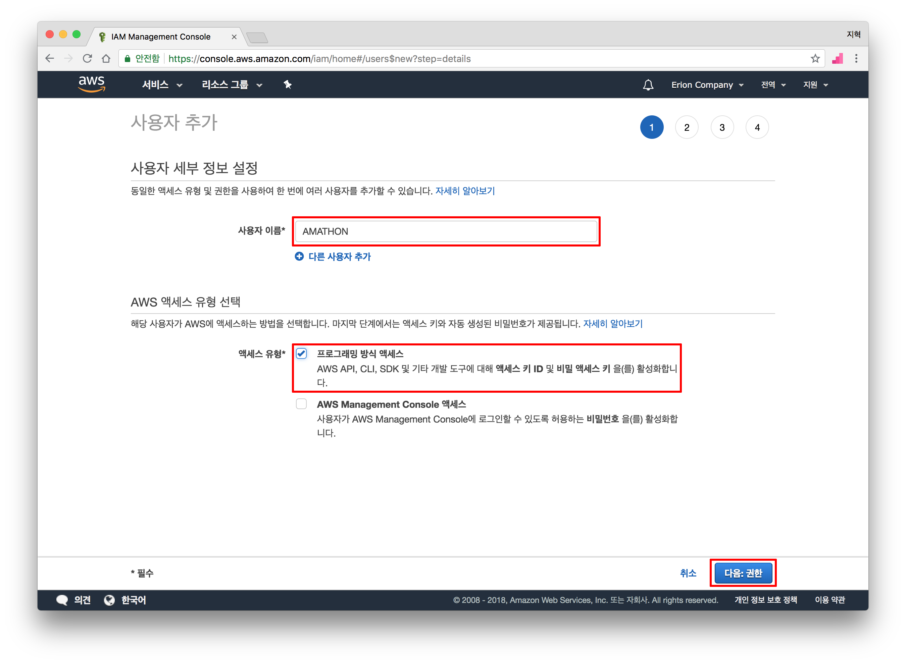
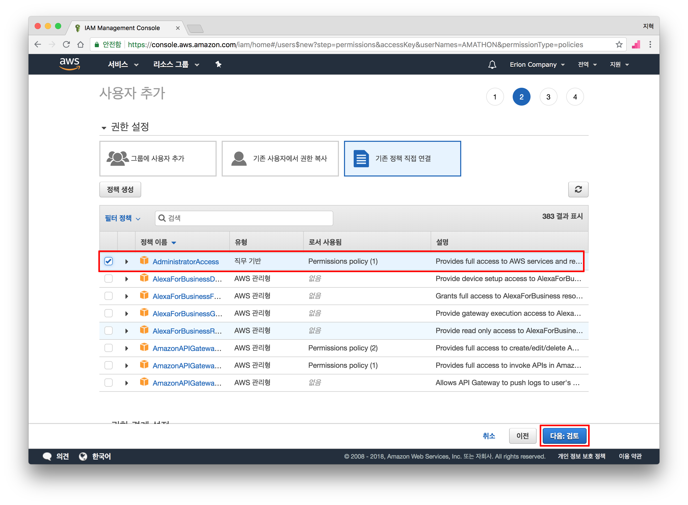
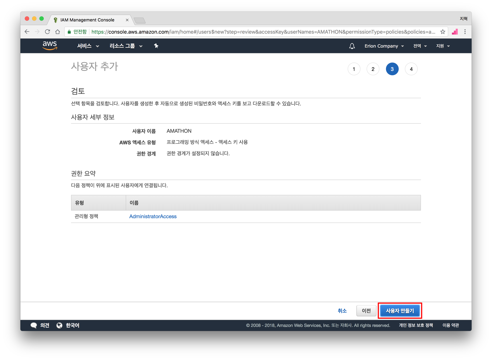
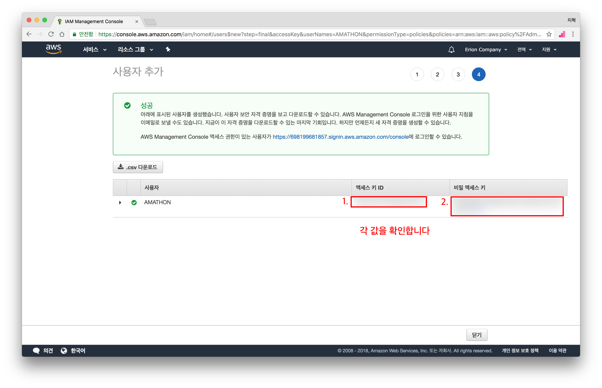
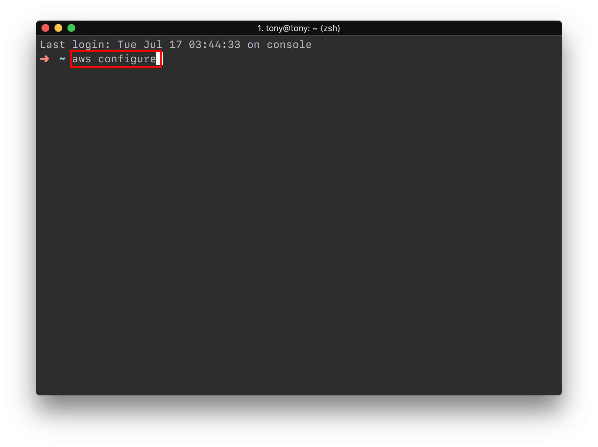
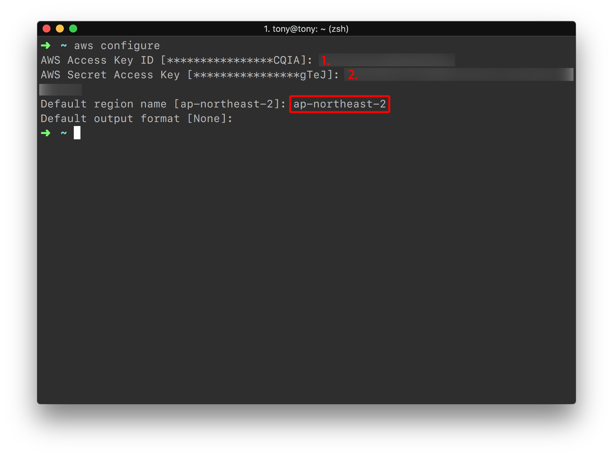

# IAM에서 유저 생성하기

### 학습 목표

- IAM User를 생성하고 내 로컬 컴퓨터에 해당 인증 정보를 저장하기

## IAM 설정하기

- AWS Console로 이동

- IAM으로 이동

  

- `사용자` 탭으로 이동 한 뒤 `사용자 추가` 클릭

  

- 사용자 이름을 넣고, 액세스 유형에 `프로그래밍 방식 액세스` 선택, `다음 ` 클릭

  

- `기존 정책 직접 연결` 클릭, `AdministratorAccess` 선택 후, `다음: 검토` 클릭

  > 본 워크샵에서 사용하는 유저는 해당 계정의 모든 자원에 접근 할 수 있는 `AdministatorAccess` 를 가집니다. 액세스 키 ID(Access Key ID)와 비밀 액세스 키(Secret Access Key) 관리에 유념하세요

  

- 작성한 내용을 검토 한 뒤 `사용자 만들기` 를 클릭합니다

  

- `액세스 키 ID` 와 `비밀 액세스 키` 를 확인합니다.

  

  ## 내 로컬 컴퓨터에 해당 계정 정보 등록하기

- 터미널(Terminal.app)을 열고 `aws configure` 명령어를 입력합니다.

  

- 각 키를 입력하는 란이 나오면 전에 확인한 `액세스 키 ID` 와 `비밀 액세스 키` 를 차례대로 넣어줍니다.

- `Default region name` 을 입력하는 란이 나오면 `ap-northeast-2` 를 입력해줍니다. (AWS 서울 리전을 의미합니다)

  