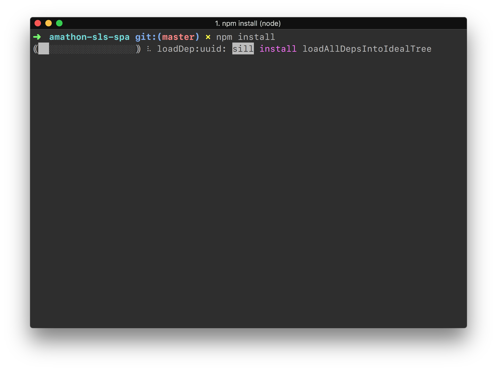
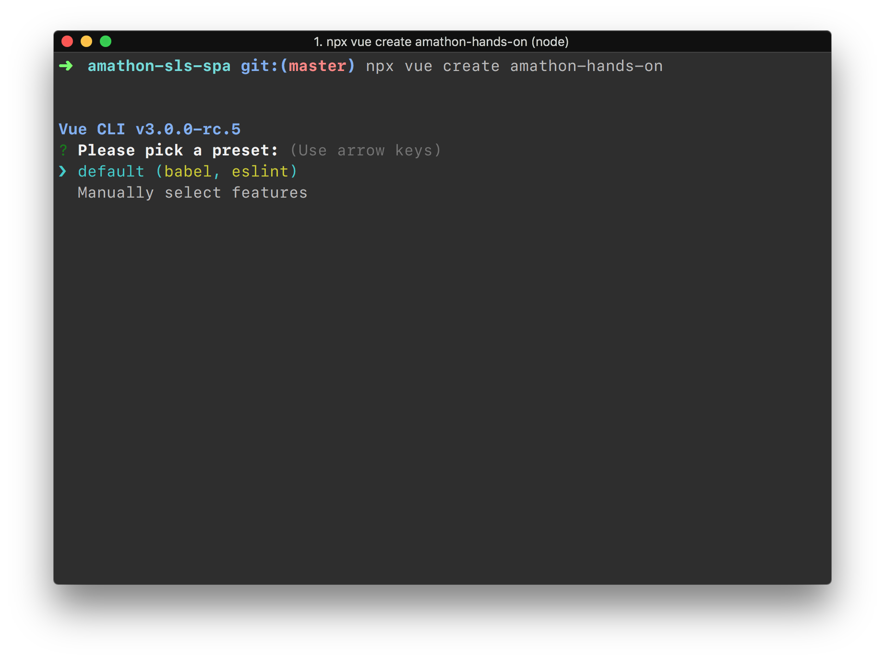
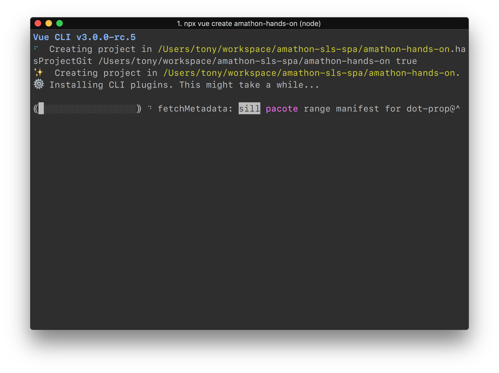
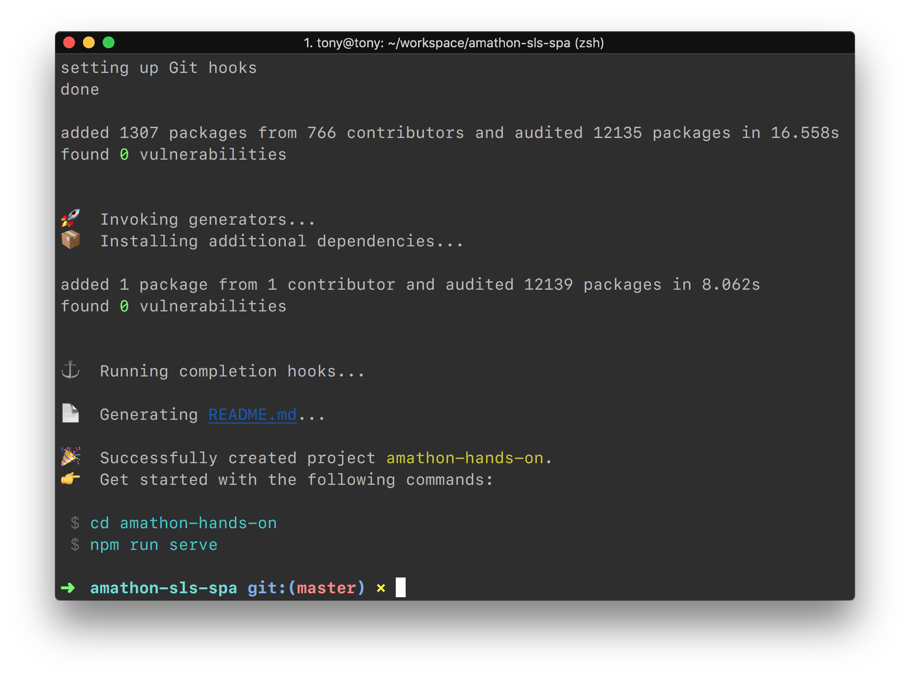
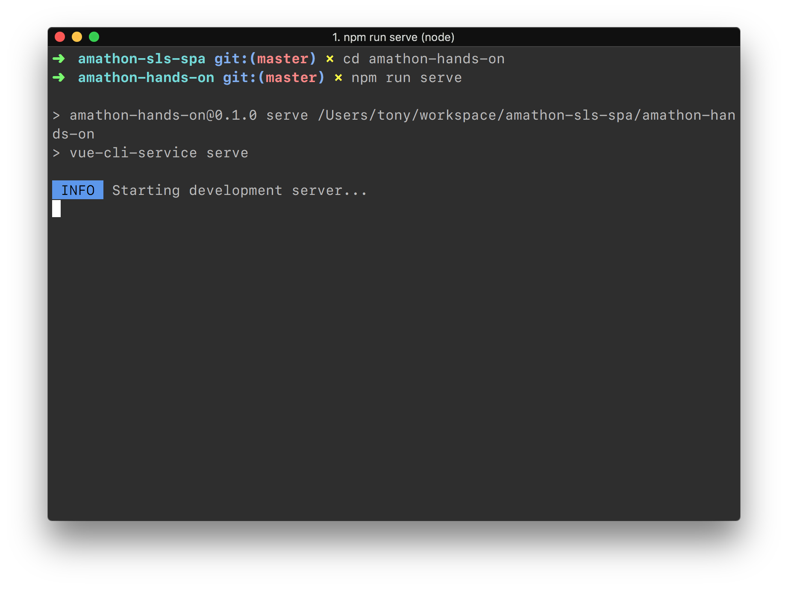
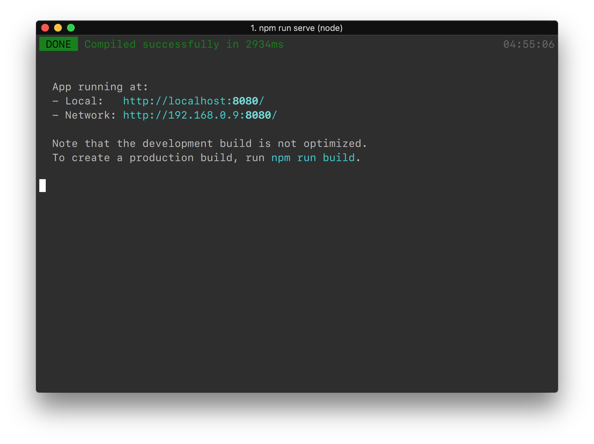
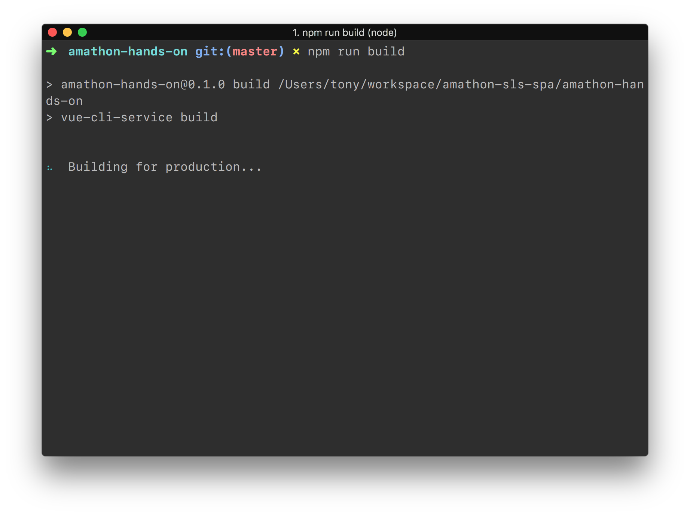
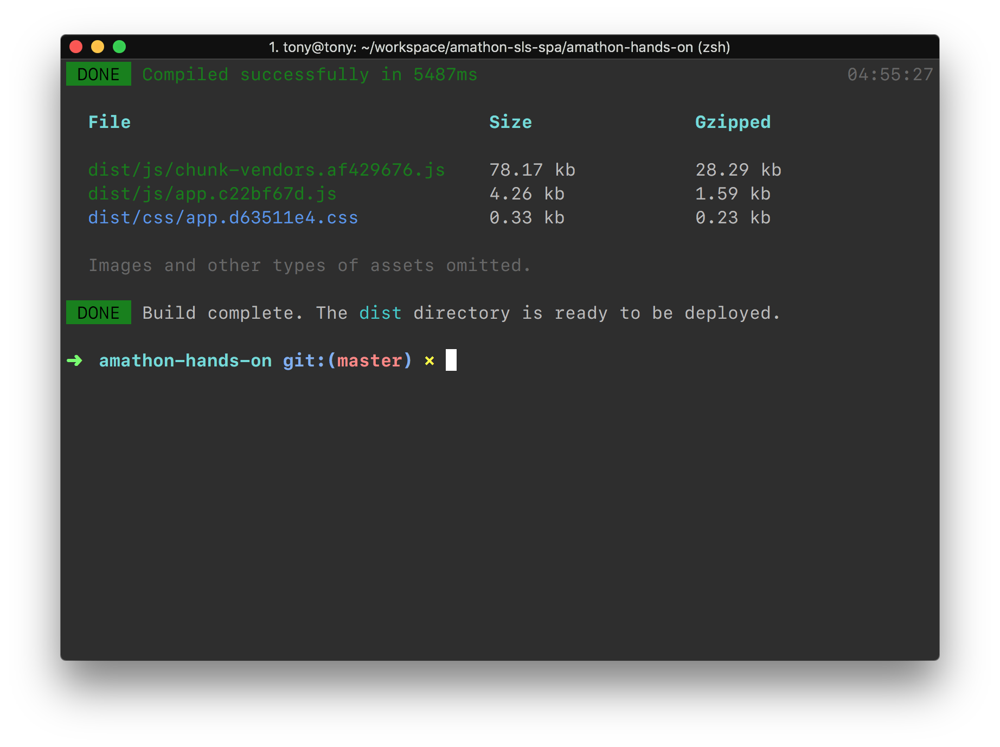

# 새로운 Vue.js 앱 생성하기

### 학습 목표

- 새로운 Vue.js 앱 프로젝트를 시작하기
- 빌드 된 파일을 분석 한 뒤 배포 환경에 대해 생각해보기


### npm에 관하여

- `npm`(Node Package Manager)은 프로젝트 내에서 사용되는 라이브러리들의 의존성을 관리합니다.

- 해당 의존성에 관한 모든 정보는 `package.json`, `package-lock.json` 에 저장됩니다.

  

### npm 기본 명령어 (참고)

- `npm install [라이브러리명]` 
  - `node_modules` 폴더 내부에 해당 라이브러리가 저장 된 후 `package.json` 의 `dependencies` 프로퍼티에 해당 항목의 메타 정보가 저장됩니다.
- `npm install -g [라이브러리명]`
  - 해당 라이브러리를 global로 설치합니다. *주로 CLI 설치에 사용*
- `npm install --save-dev [라이브러리명]`
  - `node_modules` 폴더 내부에 해당 라이브러리가 저장 된 후 `package.json` 의 `devDependencies` 프로퍼티에 해당 항목의 메타 정보가 저장됩니다.
- `npm install`
  - `package.json` 과  `package-lock.json` 파일을 참조하여 언급되어진 모든 라이브러리를 `node_modules` 폴더 아래에 설치합니다.
- `npm uninstall [라이브러리명]`
  - 해당 라이브러리를 `node_modules` 와 `dependencies` or `devDependencies` 에서 삭제합니다.
- `npx [명령어]`
  - `node_modules` 에 설치된 라이브러리 중 CLI를 지원하는 라이브러리를 실행합니다.


## Vue CLI 3 설치

> 본 실습 워크샵은 Vue.js Boilerplate로 최신 버전의 [Vue CLI 3](https://cli.vuejs.org)를 사용합니다

본 레포지토리의 root에는 `package.json` 파일이 존재합니다. 해당 파일을 확인합시다.

파일 내용을 확인했다면, `npm install` 을 입력하여 `package.json`에 포함된 의존성 라이브러리를 모두 설치합니다. (Vue CLI 3 가 포함되어 있습니다.)




## Vue 프로젝트 시작

- Vue CLI를 이용해 vue 프로젝트를 시작합니다

```bash
$ npx vue create amathon-hands-on
```

- 선택 항목이 나오면 원하는 기술 스택을 선택합니다. 본 실습 세미나에서는 기술 스택이 크게 관련이 없으므로 모두 기본값으로 진행합니다.







- `amathon-hands-on` 폴더가 생성된 모습을 확인 할 수 있습니다.
- 해당 폴더를 텍스트에디터로 열고 `vue.config.js` 파일을 생성 한 뒤 아래의 내용을 넣어줍니다.

```javascript
module.exports = {
  assetsDir: 'assets',
  baseUrl: 'dev',
}
```


## Build

- 해당 폴더로 이동하여, 개발 서버를 작동시켜봅니다

```bash
$ cd amathon-hands-on
$ npm run serve
```





- 개발 서버가 잘 작동하는지 확인하셨다면, 빌드해봅니다

```bash
$ npm run build
```





- `dist` 폴더 내부에 빌드 된 `.html`, `.css`, `.js` 파일이 존재하는지 확인합니다.


### 축하드립니다🎉🎉 `새로운 Vue.js 앱 생성하기` 챕터를 성공적으로 마치셨습니다. 다음 챕터인 [Serverless Framework 이용해 배포하기](../4_sls) 로 이동하세요