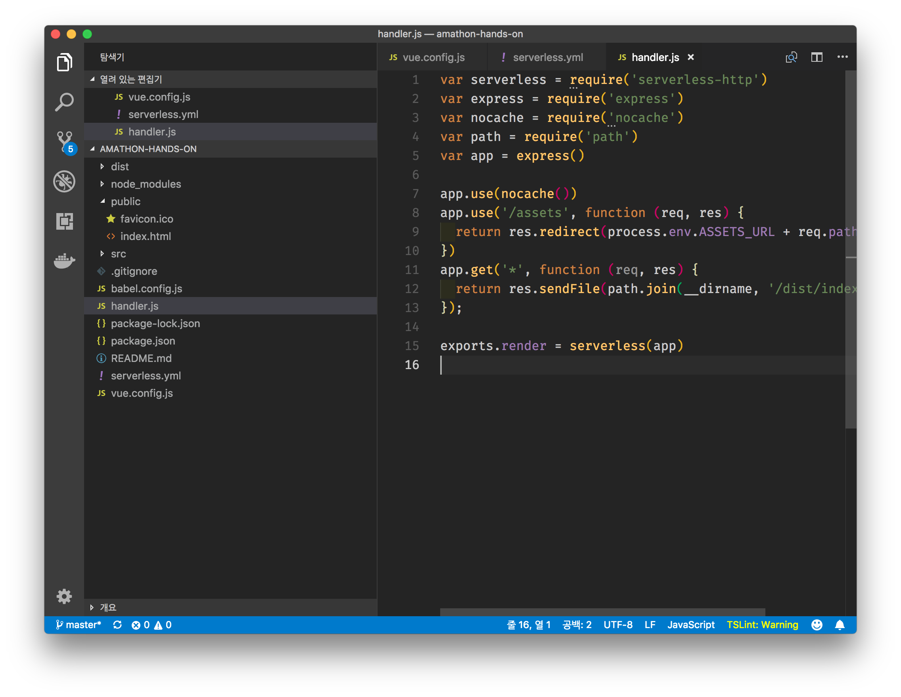
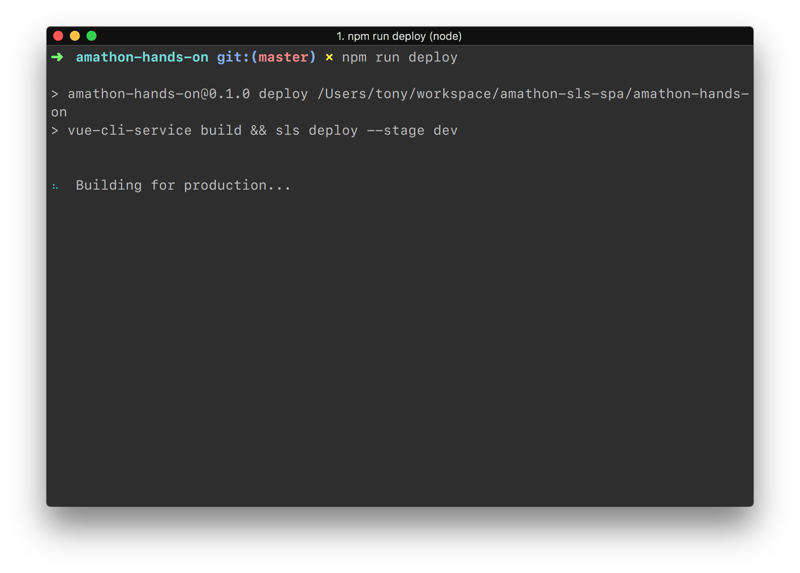
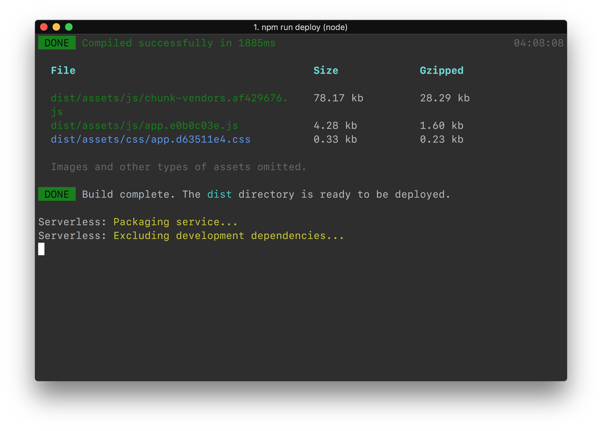
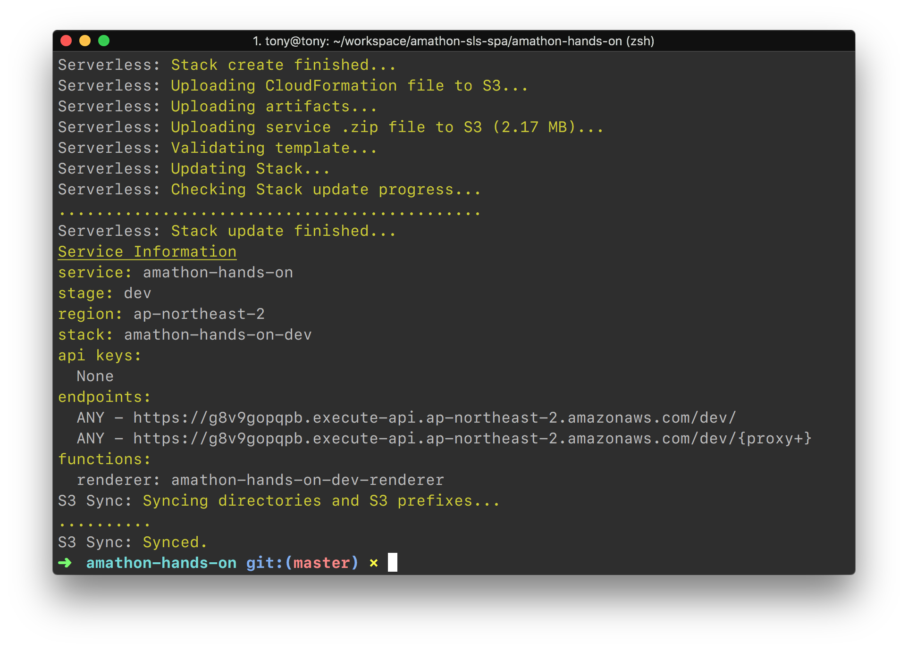

# Serverless Framework 이용해 배포하기

### 학습 목표

- Serverless Framework을 이용해 코드로 AWS Resource를 구조를 작성해본다
- Serverless Framework을 이용해 만든 앱을 배포해본다


## Serverless Framework 설치

Serverless Framework은 Node.js로 작성되었으며 npm에 등록되어 있습니다.

- Vue.js 프로젝트 폴더로 이동합니다
- 아래의 명령어를 입력합니다

```bash
$ npm i --save-dev serverless serverless-offline serverless-s3-sync
```


## Serverless Framework 설정

- 해당 폴더를 텍스트 에디터로 열고 해당 폴더에 `serverless.yml` 파일을 생성합니다
- 아래 내용을 생성한 `serverless.yml` 에 복사 붙여넣기 합니다

```yaml
service: "amathon-hands-on"

provider:
  name: aws
  runtime: nodejs8.10
  stage: ${opt:stage}
  region: ap-northeast-2
  environment:
    NODE_ENV: ${opt:stage}
    ASSETS_URL: "https://s3.ap-northeast-2.amazonaws.com/amathon-hands-on-${opt:stage}"

package:
  exclude:
    - dist/assets/**
    - public/**
    - src/**
    - tests/**
  include:
    - dist

functions:
  renderer:
    handler: handler.render
    memorySize: 512
    timeout: 5
    events:
      - http:
          path: /
          method: ANY
          cors: true
      - http:
          path: /{proxy+}
          method: ANY
          cors: true

resources:
  Resources:
    AssetsBucket:
      Type: AWS::S3::Bucket
      Properties:
        BucketName: amathon-hands-on-${opt:stage}
    AssetsBucketPolicy:
      Type: AWS::S3::BucketPolicy
      Properties:
        Bucket:
          Ref: AssetsBucket
        PolicyDocument:
          Version: "2012-10-17"
          Statement:
            -
              Action:
                - s3:GetObject
              Effect: Allow
              Resource:
                Fn::Join: 
                  - ""
                  - 
                    - "arn:aws:s3:::"
                    - 
                      Ref: AssetsBucket
                    - "/*"
              Principal: "*"

plugins:
  - serverless-offline
  - serverless-s3-sync

custom:
  serverless-offline:
    port: 4000
  s3Sync:
    - bucketName: amathon-hands-on-${opt:stage}
      localDir: dist/assets
```


## `handler.js` 함수 작성

- `handler.js`에서 사용되는 라이브러리를 아래의 명령어를 입력하여 설치합니다

```bash
$ npm i serverless-http express nocache
```


- 프로젝트 최상단 폴더에 `handler.js` 파일을 생성하고, 아래 내용을 생성한 `handler.js` 파일에 붙여 넣습니다.

```javascript
var serverless = require('serverless-http')
var express = require('express')
var nocache = require('nocache')
var path = require('path')
var app = express()

app.use(nocache())
app.use('/assets', function (req, res) {
  return res.redirect(process.env.ASSETS_URL + req.path)
})
app.get('*', function (req, res) {
  return res.sendFile(path.join(__dirname, '/dist/index.html'))
});

exports.render = serverless(app)
```



## 스크립트 설정 및 배포

- 프로젝트 최상단 폴더의 `package.json` 파일을 열고 `scripts` 속성을 다음 명령어로 교체합니다.

``` json
"scripts": {
  "serve": "vue-cli-service serve",
  "build": "vue-cli-service build",
  "lint": "vue-cli-service lint",
  "deploy": "vue-cli-service build && sls deploy --stage dev",
  "remove": "sls remove --stage dev"
},
```


- 다음 명령어를 입력하면 자동으로 배포가 시작됩니다

```bash
$ npm run deploy
```







### 축하드립니다!🎉🎉 여러분의 SPA 앱이 Serverless Framework을 통해 배포 되었습니다. 아직 끝나지 않았습니다. 다음 챕터인 [삭제 가이드](../6_delete) 로 이동하세요.