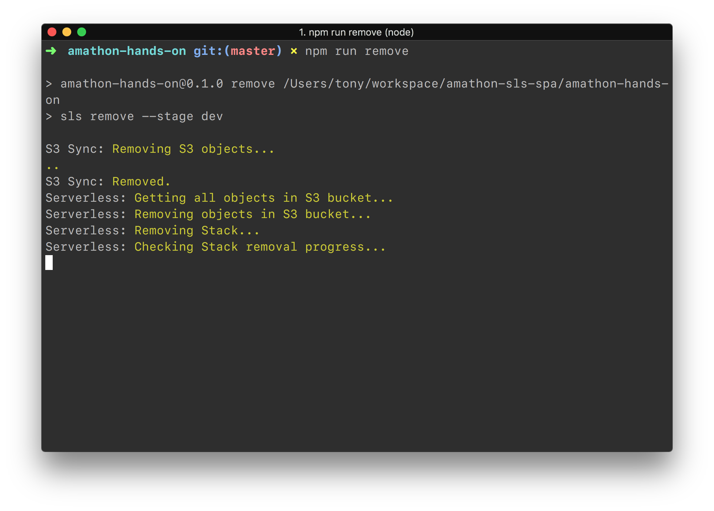
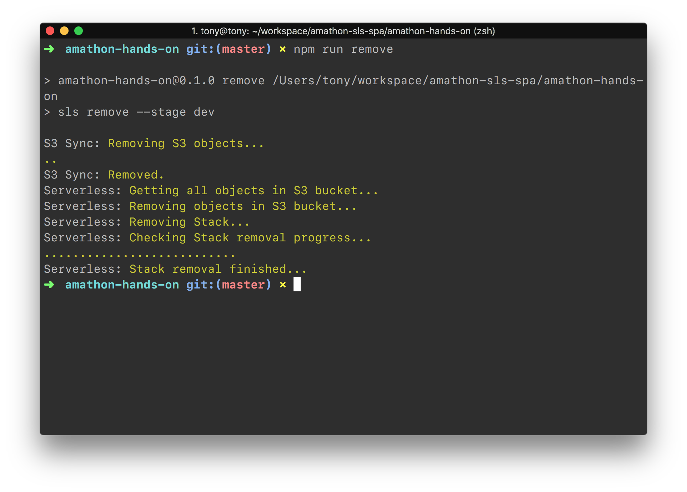

# 삭제 가이드

### [주의] AWS Console에서 AWS 자원 별로 따로 삭제를 진행하지 마세요. 아래의 명령어로 한 번에 삭제를 진행해야 CloudFormation Stack이 꼬이는 문제를 방지 할 수 있습니다


- 다음 명령어를 입력하면 자동으로 삭제가 시작됩니다

  ```bash
  $ npm run remove
  ```





### 오늘 실습 워크샵에 함께해주셔서 감사합니다.😆 내일 해커톤에서 뵈요!👋


> 본 실습 워크샵 가이드 문서는 [Erion Company](https://erion.kr)에서 제공합니다.
>
> *Real-time Lecture and Blog Platform, Erion*

