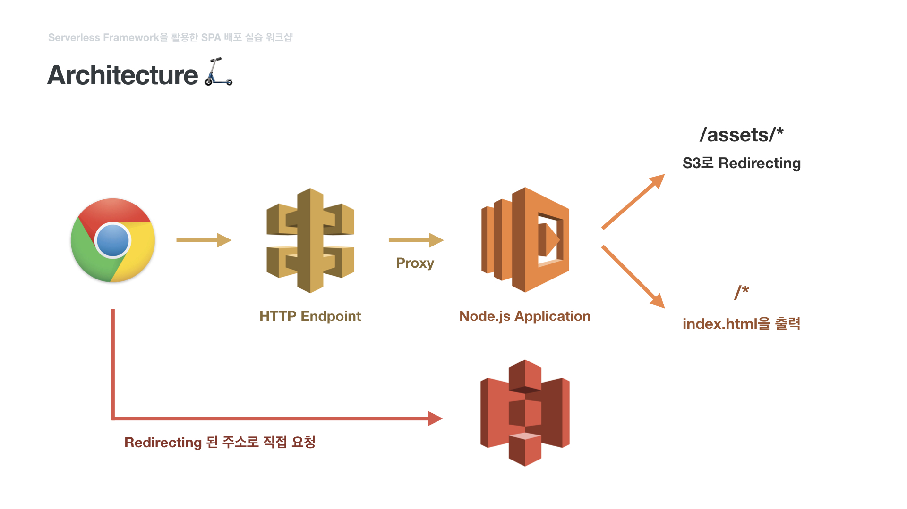

# 🔧Amathon Pre-workshop🔧: SPA Deployment using Serverless Framework🚀

AUSG가 야심차게 준비한 Amathon에 참가 신청해주신 여러분, 진심으로 환영합니다.😄 오늘 진행 할 실습 워크샵은 아마톤을 진행하기에 *앞서* 진행되는 워크샵입니다. 크게 깊은 내용은 아니지만, 행사 본래 취지에 맞게 초보자 분들도 AWS에 대한 이해를 조금 더 가져가셨으면 하는 마음으로 준비했습니다. 😌😌😌


### 본 워크샵의 학습 목표는 다음과 같습니다

- IAM를 이해한다

- S3, Lambda, API Gateway를 이해한다.

- [Serverless Framework](https://serverless.com)을 이용해 IaC(Insfrastructure as Code)를 체험해본다.

- 완성된 [Vue.js](https://vuejs.org) Application을 간단히 배포해본다.

  > [참고] 본 워크샵에서는 SPA(Single Page Application)로써 Vue.js를 예를 들어 실습을 진행합니다. React 환경에서도 몇가지 설정을 통하면 동일한 아키텍쳐로 배포 가능합니다.


# 필수 준비 사항

### 0. 본 Github Repository를 Download 해주세요!

중간중간 실습 파일들이 업로드 되어있습니다. 워크샵 시작 전 미리 다운 받아주세요! [다운로드](https://github.com/witherion/amathon-sls-spa/archive/master.zip)

### 1. PC 또는 Mac

본 워크샵은 코딩 과정이 포함되어 있습니다. 또한 CLI(Command Line Interface) 조작이 꼭 필요합니다. 모바일 환경(iPhone, iPad, Android)에서는 진행이 불가능하니 꼭 PC/Mac 환경에서 진행하세요.

> [참고] 본 실습 워크샵은 UNIX 환경을 전제로 하고 있습니다. Windows 사용자께서는 실습 전 Linux를 설치하시거나 Cloud9등 Virtual Workspace 이용을 권장 드립니다.

### 2. AWS 계정

- AWS 계정 만들기 [이동](https://aws.amazon.com/ko/)

본 가이드는 한명이 하나의 AWS 계정을 사용한다고 가정합니다. AWS IAM, S3, API Gateway, Lambda에 접근할 수 있어야 하며, 다른 사람과 계정을 공유하게되면 특정 리소스에 대해 충돌이 발생하므로 권장하지 않습니다.

본 워크샵의 일환으로 시작하는 모든 리소스는 AWS 계정이 12개월 미만인 경우, 제공하는 AWS 프리티어를 통해 충분히 무료 범위 내에서 실습 가능합니다. 만약 프리티어를 넘어서는 경우, 과금 될 수도 있습니다. 따라서, 새로운 실습용 계정을 만드시길 권장합니다. 자세한 내용은 [AWS 프리 티어 페이지](https://aws.amazon.com/free/)를 참조하세요.

### 3. 웹 브라우저

- Chrome 최신 버전 [다운로드](https://www.google.com/chrome/)
- Firefox 최신 버전 [다운로드](https://www.mozilla.org/ko/firefox/new/)

본 실습 워크샵은 웹 기반입니다. 둘 중 원하시는 브라우저를 사용해주세요. 

> Internet Explorer는 AWS Web Console에서 문제가 발생 할 수 있습니다.

### 4. 텍스트 에디터

- VS Code [다운로드](https://code.visualstudio.com/)
- Atom [다운로드](https://atom.io/)

본 실습 워크샵은 실제 코딩이 포함됩니다. 텍스트 에디터를 아직 설치하지 않으셨다면 위의 두 에디터 중 하나를 꼭 설치해주세요.

### 5. Node.js

- Node.js 8 [다운로드](https://nodejs.org/en/)

[npm](https://www.npmjs.com/)을 사용하시려면 반드시 설치하셔야합니다. AWS Lambda는 Node.js 8 버전을 기반으로 운영되므로, 개발과 운영 환경을 통일하기 위해 꼭 8 버전을 설치해주세요.

> 여러 버전을 쉽게 관리하고 싶으시다면 [nvm](https://github.com/creationix/nvm)(Node Version Manager)을 이용해보세요

### 6. AWS CLI

- AWS CLI [다운로드](https://aws.amazon.com/ko/cli/?sc_channel=PS&sc_campaign=acquisition_KR&sc_publisher=google&sc_medium=english_command_line_b&sc_content=aws_cli_e&sc_detail=aws%20cli&sc_category=command_line&sc_segment=161196943574&sc_matchtype=e&sc_country=KR&s_kwcid=AL!4422!3!161196943574!e!!g!!aws%20cli&ef_id=Wz9CBAAAAMmM8BCq:20180716200535:s)
- Python [다운로드](https://www.python.org/downloads/)

AWS IAM 정보를 로컬 컴퓨터에 담기 위해서 반드시 AWS CLI 설치가 필요합니다. AWS CLI는 Python 런타임을 반드시 필요로 하며 설치는 Python의 의존성 관리 툴인 `pip` 를 통해 진행됩니다.

```bash
$ pip install awscli
# 또는
$ pip3 install awscli
```


# 전체적인 구조

단순히 실습으로 끝나는 것이 아니라 어떤 웹 프론트엔드 환경에서도 사용 할 수 있도록 General 한 구조로 짜놓았습니다.

> Assets를 Redirecting 하는 부분에서 API Gateway와 Lambda 자원이 낭비되는 경향이 있습니다. 이는 본 실습 워크샵에서 Application 빌드시 Assets 관련한 설정을 최소화하기 위함이며, 실제 Production 배포 시에는 Assets 주소를 코드 내에 삽입하면 낭비되는 자원을 최소화 할 수 있습니다.



# 자 그럼 이제 시작해볼까요?

1. [IAM에서 유저 생성하기](./1_iam/README.md)
2. [새로운 Vue.js 앱 생성하기](./2_vue/README.md)
3. [Serverless Framework 이용해 배포하기](./3_sls/README.md)
4. [삭제 가이드](./4_delete/README.md)


> 본 실습 워크샵 가이드 문서는 [Erion Company](https://erion.kr)에서 제공합니다.
>
> *Real-time Lecture and Blog Platform, Erion*

